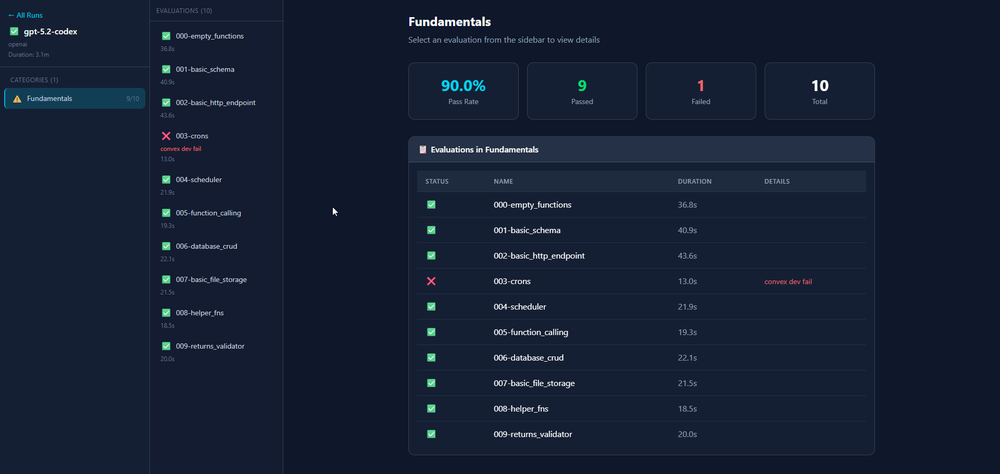
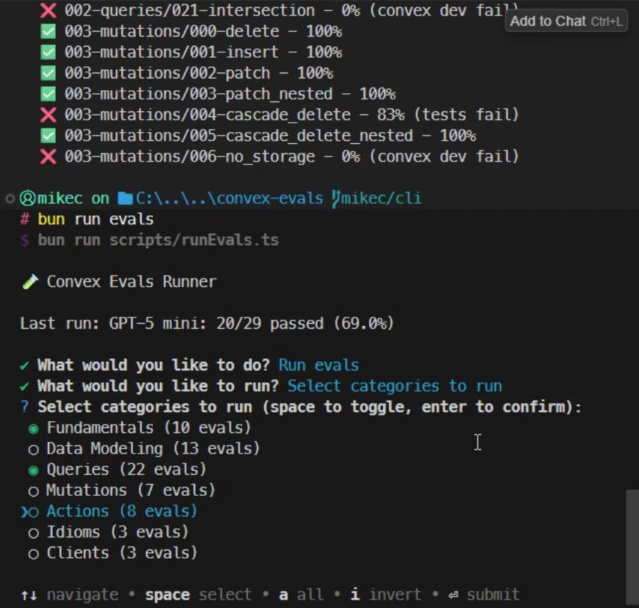

# Convex Coding Evals

Convex is an open-source, reactive database that's the best platform for full-stack AI coding.

We ensure that Convex performs well with a large set of models by continuously running evals. Each eval has a set prompts for coding a Convex backend, a set of human-curated solutions, and a script for evaluating the LLM's output. These evals are split up into seven different categories:

- Fundamentals
- Data Modeling
- Queries
- Mutations
- Actions
- Idioms
- Clients

The most up to date eval runs can be found on our [website](https://convex.dev/llm-leaderboard).

Detailed results from production runs can be visualized at [convex-evals.netlify.app](https://convex-evals.netlify.app/):



We use these evals to tune our [Convex Guidelines](https://docs.convex.dev/ai/), which greatly improve model performance writing Convex code and decrease hallucinations.

## Running the evaluations

First, install dependencies:

```bash
npm install -g bun
bun install

echo "ANTHROPIC_API_KEY=<your ANTHROPIC_API_KEY>" > .env
echo "OPENAI_API_KEY=<your OPENAI_API_KEY>" >> .env
```

### Using the CLI (recommended)

The easiest way to run evals is with the interactive CLI:

```bash
bun run evals
```

[](docs/assets/cli.mp4)

This launches an interactive menu where you can:

- Run all evals
- Select specific categories to run
- Select individual evals
- Re-run failed evals from your last run
- Choose which model(s) to use

#### CLI Commands

| Command                         | Description                            |
| ------------------------------- | -------------------------------------- |
| `bun run evals`                 | Interactive mode                       |
| `bun run evals list`            | List all available evals by category   |
| `bun run evals status`          | Show results from last run             |
| `bun run evals status --failed` | Show only failed evals                 |
| `bun run evals models`          | List available models                  |
| `bun run evals:failed`          | Re-run only failed evals from last run |

#### CLI Options

Run evals directly without interactive mode:

```bash
# Run specific categories
bun run evals run -c 000-fundamentals 002-queries

# Run with a specific model
bun run evals run -m claude-sonnet-4-5 -c 005-idioms

# Run with multiple models
bun run evals run -m claude-sonnet-4-5 -m gpt-5 -f "000-fundamentals"

# Re-run failed evals
bun run evals run --failed

# Filter by regex pattern
bun run evals run -f "pagination"

# Post results to Convex database
bun run evals run --post-to-convex -c 000-fundamentals
```

### Running directly

You can run the eval runner directly:

```bash
bun run runner/index.ts
```

You can specify a test filter regex via an environment variable:

```bash
TEST_FILTER='data_modeling' bun run runner/index.ts
```

The test will also print out what temporary directory it's using for storing the generated files. You can override this
with the `OUTPUT_TEMPDIR` environment variable.

```bash
OUTPUT_TEMPDIR=/tmp/convex-codegen-evals bun run runner/index.ts
```

### Environment variables

| Variable               | Description                                                         |
| ---------------------- | ------------------------------------------------------------------- |
| `MODELS`               | Comma-separated list of models to run                               |
| `TEST_FILTER`          | Regex pattern to filter evals                                       |
| `OUTPUT_TEMPDIR`       | Directory for generated output files                                |
| `CONVEX_EVAL_URL`      | Convex deployment URL (e.g. `https://xxx.convex.cloud`)             |
| `CONVEX_AUTH_TOKEN`    | Auth token for the Convex backend                                   |

### Output

- Per-step progress lines with the eval id
- Per-eval result with pass/fail status and a clickable output dir

## AI grading helper

Grader tests can include an AI-based assessment that provides concise reasoning on failure. See the "AI grading" section in `EVAL_WORKFLOW.md` for details and usage with `createAIGraderTest(import.meta.url)`.

## Adding a new evaluation

Note that test or category names cannot contain dashes.

1. Create a new directory under `evals/<category>/<name>/`
2. Add a `TASK.txt` file describing what the LLM should do
3. Add an `answer/` directory with the human-curated solution
4. Add a `grader.test.ts` file with unit tests
5. Run the eval to verify it works

## Generating guidelines

```bash
bun run build:release
```

This will generate guideline files in the `dist/` directory for various AI coding assistants.

## Listing models

```bash
bun run list:models
bun run runner/listModels.ts --frequency daily --format json
```

# Outstanding Evals

- [ordering](https://docs.convex.dev/database/reading-data#ordering)
