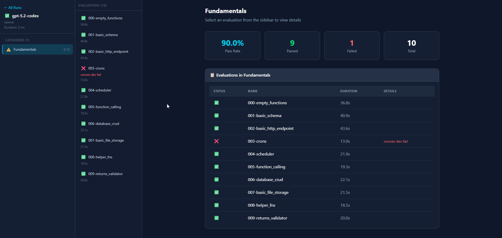
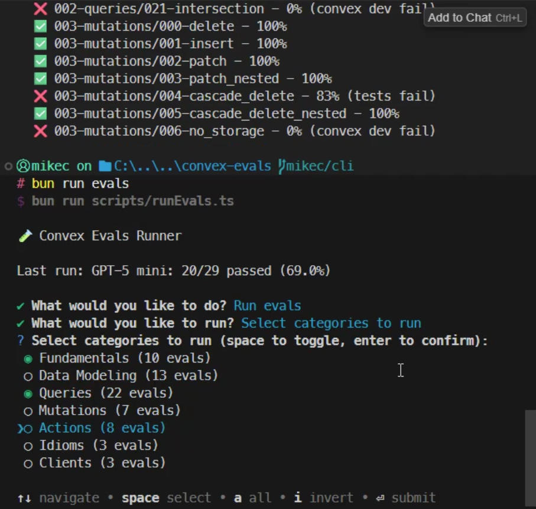

# Convex Coding Evals

Convex is an open-source, reactive database that's the best platform for full-stack AI coding.

We ensure that Convex performs well with a large set of models by continuously running evals. Each eval has a set prompts for coding a Convex backend, a set of human-curated solutions, and a script for evaluating the LLM's output. These evals are split up into seven different categories:

- Fundamentals
- Data Modeling
- Queries
- Mutations
- Actions
- Idioms
- Clients

The most up to date eval runs can be found on our [website](https://convex.dev/llm-leaderboard).

Detailed results from production runs can be visualized at [convex-evals.netlify.app](https://convex-evals.netlify.app/):



We use these evals to tune our [Convex Guidelines](https://docs.convex.dev/ai/), which greatly improve model performance writing Convex code and decrease hallucinations.

## Running the evaluations

First, install dependencies:

```bash
npm install -g bun
bun install

echo "ANTHROPIC_API_KEY=<your ANTHROPIC_API_KEY>" > .env
echo "OPENAI_API_KEY=<your OPENAI_API_KEY>" >> .env
```

### Using the CLI (recommended)

The easiest way to run evals is with the interactive CLI:

```bash
bun run evals
```

[](docs/assets/cli.mp4)

This launches an interactive menu where you can:

- Run all evals
- Select specific categories to run
- Select individual evals
- Re-run failed evals from your last run
- Choose which model(s) to use

#### CLI Commands

| Command                         | Description                            |
| ------------------------------- | -------------------------------------- |
| `bun run evals`                 | Interactive mode                       |
| `bun run evals list`            | List all available evals by category   |
| `bun run evals status`          | Show results from last run             |
| `bun run evals status --failed` | Show only failed evals                 |
| `bun run evals models`          | List available models                  |
| `bun run evals:failed`          | Re-run only failed evals from last run |

#### CLI Options

Run evals directly without interactive mode:

```bash
# Run specific categories
bun run evals run -c 000-fundamentals 002-queries

# Run with a specific model
bun run evals run -m claude-sonnet-4-5 -c 005-idioms

# Run with multiple models
bun run evals run -m claude-sonnet-4-5 -m gpt-5 -f "000-fundamentals"

# Re-run failed evals
bun run evals run --failed

# Filter by regex pattern
bun run evals run -f "pagination"

# Post results to Convex database
bun run evals run --post-to-convex -c 000-fundamentals
```

### Running directly

You can run the eval runner directly:

```bash
bun run runner/index.ts
```

You can specify a test filter regex via an environment variable:

```bash
TEST_FILTER='data_modeling' bun run runner/index.ts
```

The test will also print out what temporary directory it's using for storing the generated files. You can override this
with the `OUTPUT_TEMPDIR` environment variable.

```bash
OUTPUT_TEMPDIR=/tmp/convex-codegen-evals bun run runner/index.ts
```

### Environment variables

| Variable               | Description                                                         |
| ---------------------- | ------------------------------------------------------------------- |
| `MODELS`               | Comma-separated list of models to run                               |
| `TEST_FILTER`          | Regex pattern to filter evals                                       |
| `OUTPUT_TEMPDIR`       | Directory for generated output files                                |
| `CONVEX_EVAL_URL`      | Convex deployment URL (e.g. `https://xxx.convex.cloud`)             |
| `CONVEX_AUTH_TOKEN`    | Auth token for the Convex backend                                   |

### Output

- Per-step progress lines with the eval id
- Per-eval result with pass/fail status and a clickable output dir

## Adding a new evaluation

Note that test or category names cannot contain dashes.

1. Create a new directory under `evals/<category>/<name>/`
2. Add a `TASK.txt` file describing what the LLM should do
3. Add an `answer/` directory with the human-curated solution
4. Add a `grader.test.ts` file with unit tests
5. Run the eval to verify it works

### Implementing the answer

1. Create `schema.ts` first
2. Run codegen to generate types:
   ```bash
   cd evals/<category>/<eval>/answer && bunx convex codegen
   ```
3. Implement solution files
4. Run codegen again after any schema changes

## Writing evals

### What we're testing

These evals measure whether a model understands Convex - not whether it can follow detailed instructions. This creates a deliberate tension when writing tasks:

- **Be explicit** about the shape of the problem: schema, function names, argument types, return structure, which files to create.
- **Don't over-specify** Convex implementation details that are covered in the guidelines (e.g. when to use `internalMutation`, how to call functions via `internal.*`, how to export queries alongside an HTTP router). If a model needs the task to spell those out, it's failing the eval for the right reason.

When reviewing a failure, the first question should be: "Is this something the guidelines already cover?" If yes, it's a model fault - not a task problem. Only add detail to a task when the requirement is genuinely ambiguous or the model's interpretation was reasonable given the guidelines.

### Writing good prompts

1. **Be explicit about schema** - always provide the complete schema in the prompt using TypeScript code blocks

2. **Clear requirements** - for each function, specify:
   - Exact function name
   - Required arguments and their types
   - Expected return type/structure
   - Any specific behaviors or edge cases to handle

3. **Scope the context** - describe what the feature does, but trust the model to know *how* to implement it in Convex. Don't assume knowledge of the problem domain; do assume knowledge of Convex patterns from the guidelines.

4. **Implementation constraints** - specify what files to create, what NOT to do, and any performance considerations that aren't obvious from the guidelines.

### Common pitfalls

1. **Ambiguous requirements** - don't leave function names unspecified; don't use vague terms like "appropriate" without context; always specify exact field names and types

2. **Over-complication** - don't test multiple concepts in one eval; keep schemas focused on the tested concept

3. **Missing context** - describe the problem domain clearly, but don't explain Convex mechanics that are already in the guidelines

4. **Untestable requirements** - make success criteria measurable; specify exact return types; include specific test cases

5. **Over-specification** - spelling out every Convex detail (e.g. which function type to use, how the internal API works) defeats the purpose of the eval; if a model needs that hand-holding, that's a meaningful signal

### Eval structure

Each eval directory contains:

- `TASK.txt` - the prompt sent to the model
- `answer/` - the human-curated reference solution
- `grader.test.ts` - Vitest tests that score the model's output

### Common eval types

- **Data modeling** - table relationships, index design, schema validation
- **Query patterns** - CRUD, index usage, filtering, joins, pagination, aggregation
- **Actions** - external calls, storage, node runtime, HTTP endpoints
- **Idioms** - internal functions, file organisation, batch patterns, code reuse

## AI grading

Grader tests can include a lightweight AI-based assessment that reviews the generated project and provides concise reasoning on pass/fail.

The grader builds a prompt from `TASK.txt` plus a manifest of files from the generated output directory and asks a model to decide pass/fail with reasoning. On failure, the reasoning appears directly in the test output and in `run.log`.

### Usage

Add a single standardised test using the helper:

```ts
import { createAIGraderTest } from "../../../grader/aiGrader";

// Basic usage (default name and 60s timeout)
createAIGraderTest(import.meta.url);

// Optional: custom name/timeout
createAIGraderTest(import.meta.url, "AI grader assessment", 60000);
```

## Generating guidelines

```bash
bun run build:release
```

This will generate guideline files in the `dist/` directory for various AI coding assistants.

## Listing models

```bash
bun run list:models
bun run scripts/listModels.ts --format json
bun run scripts/listModels.ts --due-only --format json
```

## Automated eval workflows

The repo has one scheduled periodic eval workflow:

- `periodic_evals.yml` runs every 2 hours
- each run unions candidates from curated models, top-day non-curated OpenRouter models, and top OpenRouter benchmark models
- the combined candidate list is deduped before the workflow matrix expands

The periodic workflow uses the same scheduling policy before it actually queues a model:

- if we have never run a model before, it is due immediately
- otherwise we look at the model's stored OpenRouter first-seen timestamp
- the target interval ramps linearly from `24h` for a brand new model to `30d` for a model that is at least 30 days old
- a model only runs when its most recent recorded run is older than that computed interval

The OpenRouter-derived selectors also do a lightweight preflight check so obviously dead models are skipped before entering the matrix.

# Outstanding Evals

- [ordering](https://docs.convex.dev/database/reading-data#ordering)
